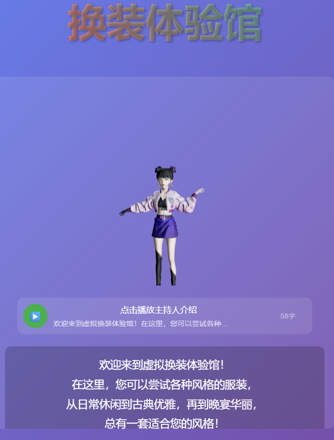
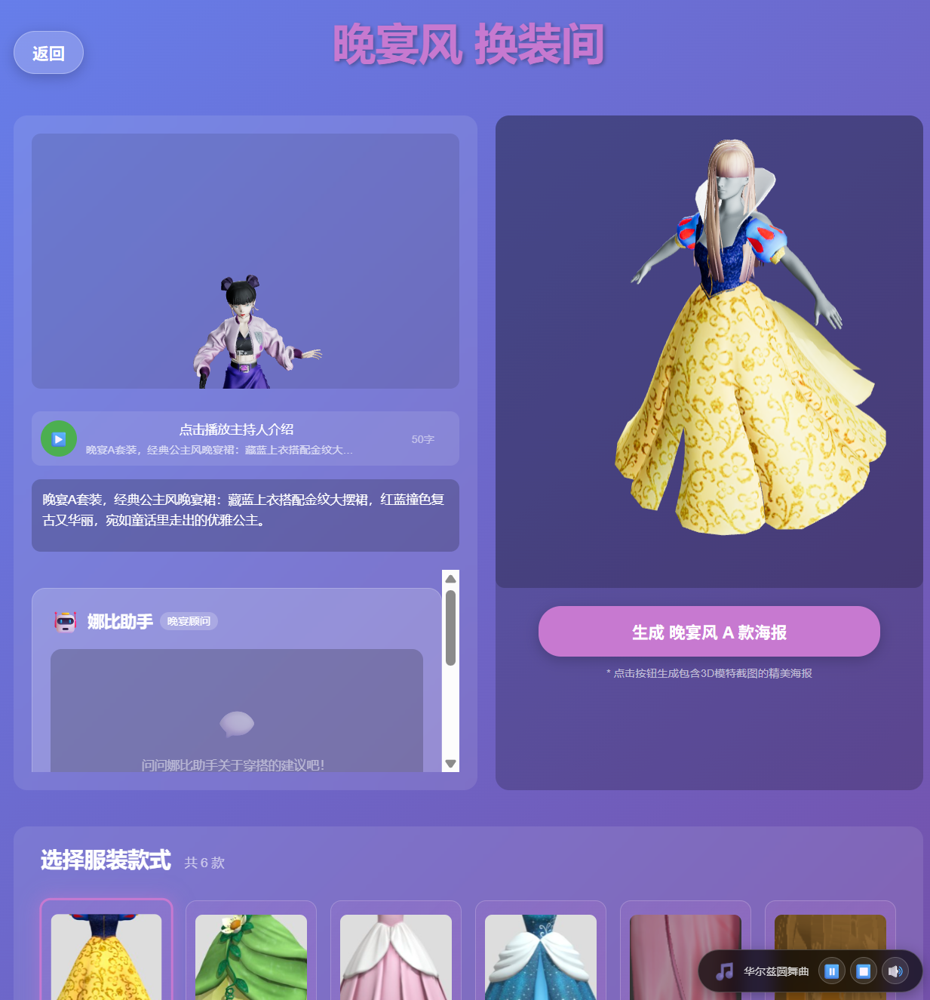

# AI 虚拟换装体验馆（AI+TTS+3D 交互）
A modern virtual dressing room application integrated with AI assistant, TTS voice interaction, 3D model rendering, and background music generation. 基于 React + Three.js 构建，支持日常、古装、晚宴三种风格换装，提供智能穿搭建议、语音介绍、海报生成等核心功能。

## ✨ 核心功能
- 🎭 **3D 实时换装**：支持 3D 模特模型与服装绑定，可旋转、缩放查看换装效果
- 🤖 **AI 智能助手**："娜比助手" 提供穿搭建议、风格解析、场合推荐
- 🎤 **TTS 语音交互**：主持人语音介绍服装特点，支持自动播放与手动控制
- 🎵 **风格化背景音乐**：不同风格换装间自动匹配对应氛围音乐（日常轻音乐/古风雅韵/晚宴圆舞曲）
- 📸 **海报生成**：一键生成包含 3D 模特截图、服装信息的精美海报，支持下载与分享
- 🎨 **三种风格可选**：日常风（休闲舒适）、古装风（古典雅致）、晚宴风（华丽高端）




## 📋 技术栈
| 分类         | 核心技术/库                                                                 |
|--------------|-----------------------------------------------------------------------------|
| 前端框架     | React 18                                                                   |
| 3D 渲染      | Three.js、@react-three/fiber、@react-three/drei（GLTF 模型加载与动画）        |
| 网络请求     | Axios、http-proxy-middleware（跨域代理）                                    |
| AI 交互      | 智谱 GLM-4V-Plus 大模型                                                    |
| 语音合成     | GPT-SoVITS TTS 服务                                                         |
| 音乐生成     | ACE-Step 文生音乐服务                                                       |
| 海报生成     | html2canvas（DOM 转图片）                                                   |
| 路由管理     | React Router v6                                                            |

## 📁 项目结构
```
AIDRESSING-ROOM/
├── public/                # 静态资源
│   ├── images/            # 服装预览图（按风格分类）
│   ├── models/            # 3D模型文件（glb格式，含人体与服装）
│   └── index.html         # 入口HTML
├── src/
│   ├── services/          # 核心服务
│   │   ├── aiService.js   # AI助手服务（对接智谱API）
│   │   ├── ttsService.js  # TTS语音合成服务
│   │   ├── musicService.js # 背景音乐服务
│   │   ├── posterService.js # 海报生成服务
│   │   └── hostDialog.js  # 主持人话术库
│   ├── components/        # 功能组件
│   │   ├── ModelViewer.jsx # 3D模型查看器（核心组件）
│   │   ├── AIAssistant.jsx # AI助手聊天组件
│   │   ├── DressingRoom.jsx # 换装间主组件
│   │   ├── VoicePlayer.jsx # 语音播放器
│   │   ├── MusicPlayer.jsx # 音乐播放器
│   │   └── PosterGenerator.jsx # 海报生成器
│   ├── setupProxy.js      # 跨域代理配置
│   ├── App.js/.css        # 根组件与全局样式
│   └── index.js/.css      # 入口文件
├── .env                   # 环境变量（本地配置，不上传Git）
├── .env.example           # 环境变量示例
├── .gitignore             # Git忽略文件
├── package.json           # 依赖配置
└── README.md              # 项目文档
```

## 🚀 快速开始
### 1. 环境准备
- Node.js ≥ 16.x
- npm ≥ 7.x 或 yarn ≥ 1.22.x
- （可选）Git LFS（用于上传大体积 3D 模型文件）

### 2. 项目克隆与依赖安装
```bash
# 克隆仓库
git clone https://github.com/你的用户名/AIDRESSING-ROOM.git
cd AIDRESSING-ROOM

# 安装依赖
npm install
# 或使用yarn
yarn install
```

### 3. 环境变量配置
1. 复制示例文件创建 `.env`（**不要提交到Git**）：
   ```bash
   cp .env.example .env
   ```
2. 编辑 `.env` 配置关键参数：
   ```ini
   # AI 服务配置（智谱API）
   REACT_APP_AI_API_URL=https://open.bigmodel.cn/api/paas/v4/chat/completions
   REACT_APP_AI_API_KEY=你的智谱API密钥
   REACT_APP_AI_MODEL=glm-4v-plus

   # TTS 服务配置（GPT-SoVITS）
   REACT_APP_TTS_API_URL=http://你的TTS服务器地址/api/tts

   # 音乐服务配置（ACE-Step）
   REACT_APP_MUSIC_API_URL=http://你的音乐服务器地址/api/music
   REACT_APP_MUSIC_VOLUME=0.7
   ```

### 4. 启动开发服务器
```bash
npm start
# 或
yarn start
```
项目将在 `http://localhost:3000` 启动，自动打开浏览器访问。

### 5. 生产环境构建
```bash
npm run build
# 或
yarn build
```
构建产物输出到 `build/` 目录，可部署到 Nginx、Netlify、Vercel 等平台。

## 🎮 使用指南
### 1. 流程导航
1. **欢迎页**：点击「开始体验」进入风格选择
2. **风格选择**：选择日常/古装/晚宴三种风格之一
3. **换装间操作**：
   - 左侧：主持人 3D 模型、语音播放器、AI 助手聊天框
   - 右侧：3D 模特换装预览，支持鼠标拖拽旋转、滚轮缩放
   - 底部：服装款式选择（A-F 共 6 款/风格）
4. **功能操作**：
   - 🔊 语音介绍：点击「播放主持人介绍」听取服装详情
   - 🤖 AI 咨询：在聊天框提问（如“这件适合约会吗？”“如何搭配配饰？”）
   - 📸 生成海报：选择服装后点击「生成精美海报」，支持下载与微信分享
   - 🎵 音乐控制：右下角可暂停/播放、调节音量、切换风格音乐

### 2. 服务器端服务启动（必需）
项目依赖外部 TTS 和文生音乐服务，需在服务器端启动以下服务：
#### TTS 服务（GPT-SoVITS）
```bash
#一个终端先
cd gpt-sovits
conda activate GPTSoVits
python api.py -a 0.0.0.0 -p 9880
#再新建一个终端：
cd gpt-sovits
conda activate GPTSoVits
curl -X POST -H "Content-Type: application/json" \
-d '{
  "refer_wav_path": "/home/niubowen/NSY/gpt-sovits/gpt-sovits/reference_audio/我的参考音频1.wav",
  "prompt_text": "新的一天开始咯，最好的娜比为你导航，the best for you，一起上路吧！",
  "prompt_language": "zh",
  "text": "欢迎来到虚拟换装体验馆！",
  "text_language": "zh"
}' http://localhost:9880/ --output welcome1.wav
```

#### 文生音乐服务（ACE-Step）
```bash
cd ~/NSY/ACE/ACE-Step
python3 -m http.server 8001 --bind 0.0.0.0
```

## ⚠️ 注意事项
1. **3D 模型加载**：
   - GLB 模型文件较大（单文件 10-50MB），首次加载可能较慢
   - 若模型加载失败，检查 `public/models/` 目录下文件是否完整
   - 大文件建议使用 Git LFS 管理：`git lfs track "*.glb" && git add .gitattributes`

2. **跨域问题**：
   - 开发环境已通过 `setupProxy.js` 配置跨域代理，无需额外设置
   - 生产环境需在服务器（Nginx/Apache）配置 CORS 允许跨域请求

3. **API 密钥安全**：
   - `.env` 文件包含敏感信息（API 密钥、服务器地址），务必添加到 `.gitignore`
   - 生产环境建议通过服务器环境变量注入，避免硬编码

4. **浏览器兼容性**：
   - 推荐使用 Chrome/Firefox 最新版本，部分浏览器可能不支持 WebGL 3D 渲染
   - 移动设备需在横屏模式下使用，体验更佳

## 📦 依赖安装说明
核心依赖已包含在 `package.json`，执行 `npm install` 即可自动安装：
- 3D 渲染：`three @react-three/fiber @react-three/drei`
- 网络请求：`axios http-proxy-middleware`
- 海报生成：`html2canvas`
- 路由管理：`react-router-dom`

## 🎨 自定义扩展
1. **添加新风格**：
   - 在 `public/images/` 和 `public/models/` 下创建新风格目录（如「汉服」）
   - 新增风格话术：在 `src/services/hostDialog.js` 中添加风格介绍和服装描述
   - 配置音乐：在 `src/services/musicService.js` 中添加新风格音乐映射

2. **更换 3D 模型**：
   - 替换 `public/models/` 下的 GLB 文件，确保模型骨骼结构与现有一致
   - 修改 `ModelViewer.jsx` 中的模型路径和缩放参数

3. **更换 TTS 音色**：
   - 在 `src/services/ttsService.js` 中修改参考音频路径和 TTS 配置参数

## 🐛 常见问题
1. **模型加载失败**：
   - 检查模型文件路径是否正确
   - 确认浏览器支持 WebGL（https://get.webgl.org/ 验证）
   - 清除浏览器缓存后重试

2. **AI 助手无响应**：
   - 检查 `.env` 中 AI API 密钥是否有效
   - 确认服务器能访问智谱 API 地址
   - 查看控制台日志排查请求错误

3. **语音生成失败**：
   - 检查 TTS 服务器是否启动
   - 确认 `setupProxy.js` 中 TTS 代理配置正确
   - 验证服务器 9880 端口是否开放

4. **海报生成失败**：
   - 确保 3D 模型已完全加载
   - 检查浏览器是否允许弹出窗口和下载
   - 确认 `html2canvas` 依赖已正确安装

## 📄 许可证
本项目基于 MIT 许可证开源，可自由用于个人和商业项目，如需二次开发或商用，请保留原作者版权声明。

## 🌟 致谢
- 3D 模型支持：Three.js 社区、@react-three 生态、blender、tripo3d.ai社区
- AI 能力支持：智谱 AI（GLM-4V-Plus）
- TTS 技术支持：GPT-SoVITS 项目 https://github.com/RVC-Boss/GPT-SoVITS
- 音乐生成支持：ACE-Step 项目 https://github.com/ace-step/ACE-Step

---
📧 如有问题或建议，欢迎提交 Issue 或联系作者！  
💻 项目地址：https://github.com/Nsyxixi/AI-DRESSING-ROOM